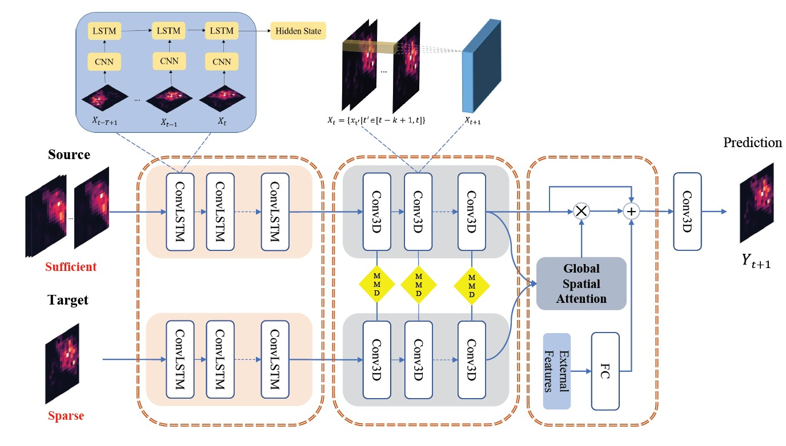

# Spatio-Temporal Knowledge Transfer for Urban Crowd Flow Prediction via Deep Attentive Adaptation Networks(ST-DAAN)
Necessary code for paper "[Spatio-Temporal Knowledge Transfer for Urban Crowd Flow Prediction via Deep Attentive Adaptation Networks](https://ieeexplore.ieee.org/document/9352560/)".  

<p align="center">
    
</p>

## Requirements

```
Numpy
scipy
Python 3.6+
Pytorch 1.0+
```

## Citation
Please cite the following paper if you use this repository in your reseach.
```
@article{wang2021spatio,
  title={Spatio-Temporal Knowledge Transfer for Urban Crowd Flow Prediction via Deep Attentive Adaptation Networks},
  author={Wang, Senzhang and Miao, Hao and Li, Jiyue and Cao, Jiannong},
  journal={IEEE Transactions on Intelligent Transportation Systems},
  year={2021},
  publisher={IEEE}
}
```

# Contact
For any question, feel free to contact:
```
Hao Miao: haomiao96@gmail.com
Senzhang Wang: szwang@csu.edu.cn
```
